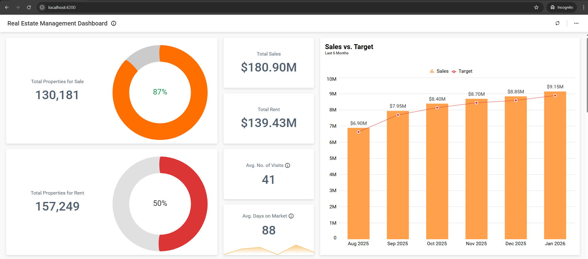
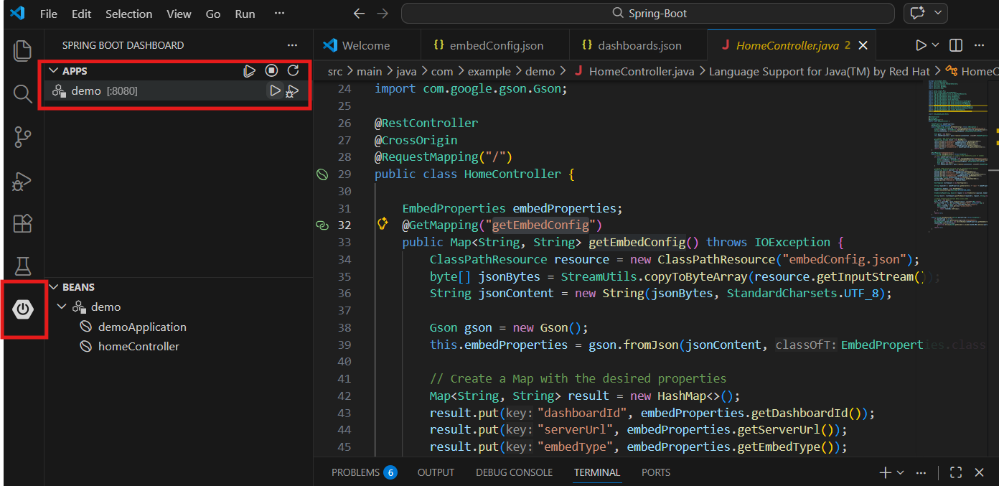

---

# BoldBI Embedding Angular with Spring Boot Sample

This project demonstrates how to render dashboards from your **Bold BI server** using an **Angular frontend** and a **Spring Boot backend**.

## Dashboard view



---

# Requirements / Prerequisites

* [Node.js](https://nodejs.org/en/)
* [Java JDK 17 or later](https://www.oracle.com/java/technologies/downloads/)
* [Visual Studio Code](https://code.visualstudio.com/download)

> **NOTE:** Node.js versions **18.18 – 20.20** are supported.

---

# Supported browsers

* Google Chrome
* Microsoft Edge
* Mozilla Firefox

---

## Configuration

* Ensure embed authentication is enabled on the `embed settings` page. If it is not enabled, follow these [instructions](https://help.boldbi.com/site-administration/embed-settings/#get-embed-secret-code?utm_source=github&utm_medium=backlinks) to enable it.

    

* To download the `embedConfig.json` file, follow this [link](https://help.boldbi.com/site-administration/embed-settings/#get-embed-configuration-file?utm_source=github&utm_medium=backlinks). See the images below for guidance.

    
    

* Copy the downloaded `embedConfig.json` into the project at the expected location (the sample's `angular` and `nodejs` folders include examples of where to place it). 

    

# Running the Sample

# Running the Spring Boot Backend

1. Open the **spring-boot** in Visual Studio Code.

2. Make sure the following VS Code extensions are installed:

   * **Extension Pack for Java**
   * **Spring Boot Extension Pack**

3. Click the **Spring Boot Dashboard** icon in the Activity Bar.



4. Locate your Spring Boot application in the dashboard.

5. Click the **Run** ▶ button next to the application.

The Spring Boot server will start.

The backend API will be available at:

```
http://localhost:8080
```

---

## Angular Frontend

1. Navigate to the **angular** folder.

```bash
cd angular
```

2. Install dependencies

```bash
npm install
```

3. Start the Angular development server

```bash
npm start
```

The Angular application will start at:

```
http://localhost:4200
```

Open this URL in your browser to view the embedded dashboard.

---

# Important Notes

* Do **not store passwords or sensitive information** directly in configuration files.
* In production environments, store secrets securely using services like **Azure Key Vault** or other secret management systems.

---